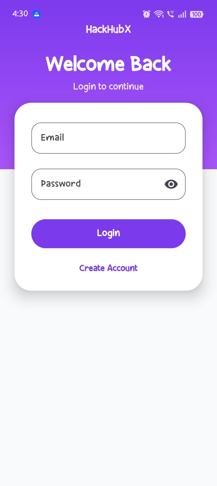
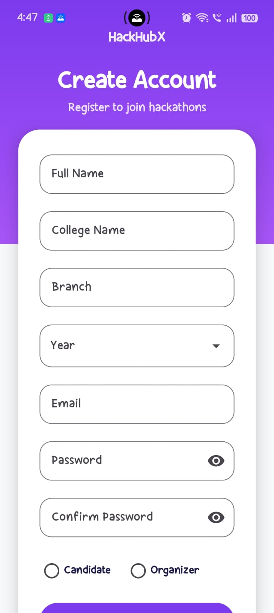
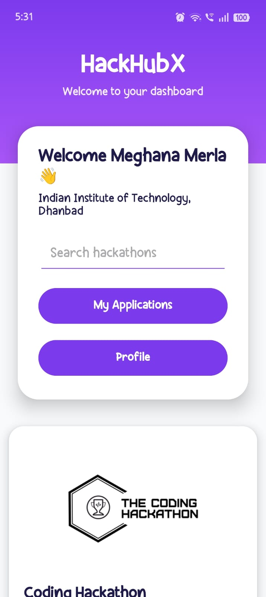
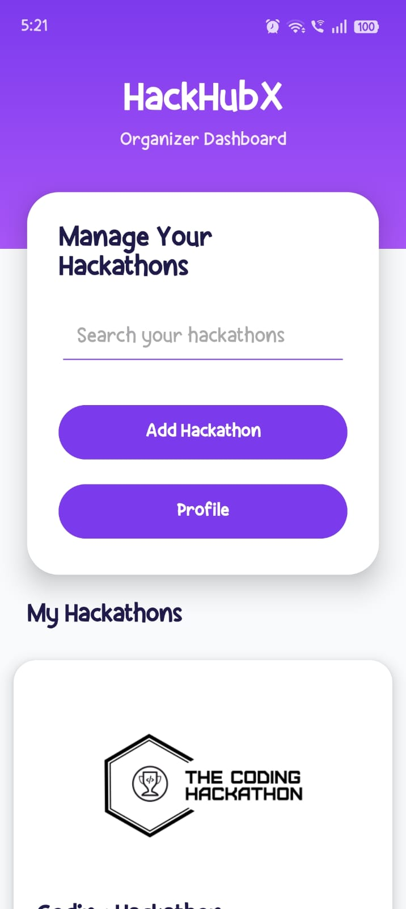
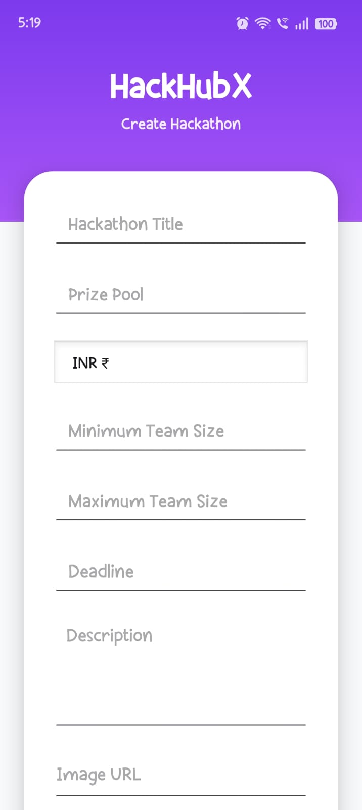
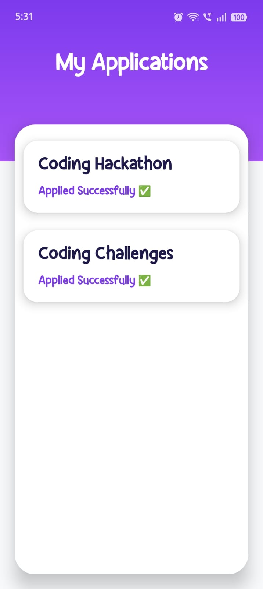
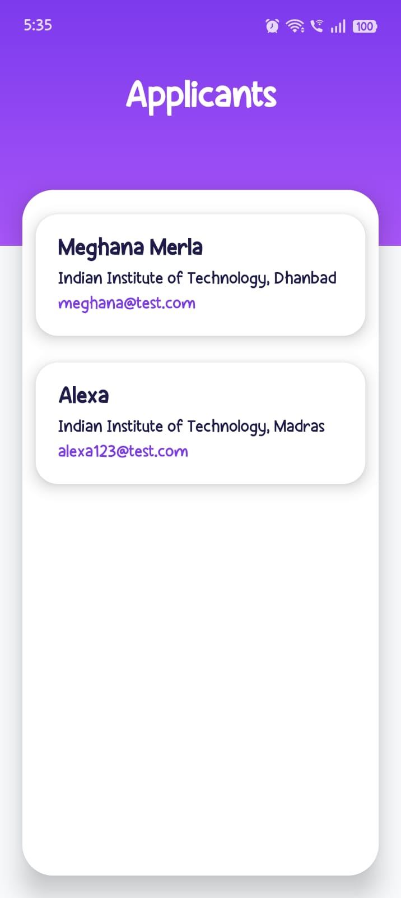
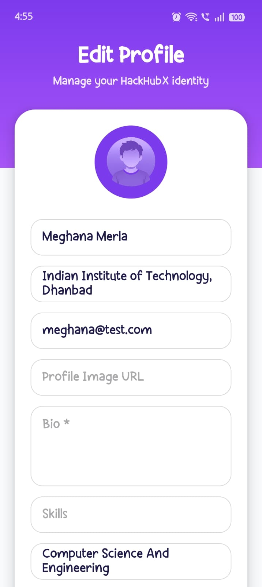

# HackHubX 🚀

HackHubX is a modern Android application built using Kotlin and Firebase that helps students discover, apply for, and manage hackathons efficiently.

The app also allows organizers to create and manage hackathons while tracking applicants in real time.

---

# ✨ Features

## 👨‍🎓 Student Features

- Browse hackathons
- Search hackathons
- Apply to hackathons
- View applied hackathons
- Edit developer profile
- Add skills, bio, GitHub, LinkedIn
- View profile details

---

## 🧑‍💼 Organizer Features

- Create hackathons
- Edit hackathons
- Delete hackathons
- View applicants
- Manage organizer dashboard

---

# 🎨 UI/UX Features

- Modern purple themed UI
- Responsive layouts
- Empty state handling
- Default profile avatars
- Clean dashboard design
- Real-time Firestore updates

---

# 🛠️ Tech Stack

- Kotlin
- Firebase Authentication
- Firebase Firestore
- RecyclerView
- Glide
- XML Layouts
- Android Studio

---

# 📸 Screenshots

## Splash Screen


---

## Login Screen



---

## Register Screen



---

## Student Dashboard



---

## Organizer Dashboard



---

## Create Hackathon



---

## Hackathon Details


---

## Applications Screen



---

## Applicants Screen



---

## Profile Screen


---

## Edit Profile Screen



---

# ⚙️ Setup Instructions

1. Clone the repository

```bash
git clone <your-repository-link>
```

2. Open the project in Android Studio

3. Connect Firebase:
   - Add `google-services.json`
   - Enable Firebase Authentication
   - Enable Firestore Database

4. Sync Gradle and run the app

---

# 📂 Project Structure

```text
HackHubX/
│
├── app/
│   ├── adapter/
│   ├── model/
│   ├── ui/
│   │   ├── auth/
│   │   ├── dashboard/
│   │   └── organizer/
│   ├── res/
│   │   ├── drawable/
│   │   ├── layout/
│   │   └── values/
│   └── MainActivity.kt
│
├── screenshots/
├── README.md
└── build.gradle
```

---

# 📌 Future Improvements

- Push notifications
- Dark mode
- Bookmark hackathons
- Advanced filtering

---

# 📚 What I Learned

- Building scalable Android applications using Kotlin and XML
- Firebase Authentication and Firestore integration
- Real-time database synchronization
- RecyclerView and adapter-based UI architecture
- Role-based app flow design for students and organizers
- UI/UX consistency and responsive mobile layouts
- Git and GitHub workflow management

---

# 👩‍💻 Developed By

Meghana Merla
